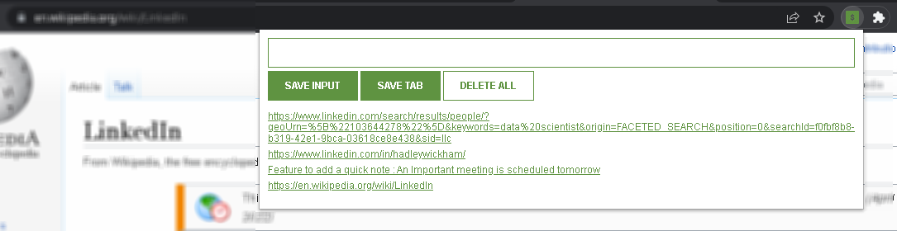

# Lead Tracker extension for chrome Browser

A lead tracker is built using HTML, CSS and JavaScript and deployed locally on Chrome Web Store which helps users to capture and organize leads from multiple sources allowing them to maximize productivity.

## 🔗 Links

